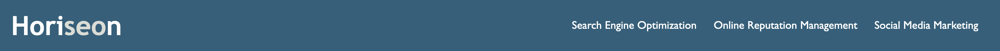

# Horiseon Social Solution Services, Inc.

## Description

The task for this project was to edit and upgrade a landing page for Horiseon Social Services. The goal was to improve accessibility, allowing all users to have a good user experience, even those with disabilities. Further, this improves the Search Engine Optimisation (SEO) of the overall site, allowing increased visibility on search engines such as Google and Bing.
This task has improved my knowledge and skills in using semantic HTML structures, condensing and organising HTML and CSS code, applying appropriate descriptions and meta titles, and writing a relevant README file that is clear and understandable. 

*"Horiseon Social Solution Services endevours to create an easy to understand guide to digital optimisation, online reputation management, and social media marketing. Brand management is important to every business which represents itself online, so understanding and applying these concepts is crucial to a successful business."*

## Table of Contents (Optional)

- [Features](#features)
- [Usage](#usage)
- [Languages Used](#languages-used)
- [Full Preview](#full-preview)
- [Credits](#credits)

## Features

- Improved HTML structure which includes tidying up the code, using semantic structures for user ease, and ensuring heading attributes fall in sequential order.
- Optimised CSS file where code has been condensed and redundant code has been removed.
- Improved Accessibility in which images have relevant and detailed descirption for each. Further, using correct HTML structure and semantics allow screen readers to navigate the content easily and efficiently.
- Included a descriptive and relevant README.md file.

## Usage

This landing page is utilised effectively by selecting the links at the top of the page, which take you to the relevant headings. Each heading provides useful information about various social media services.

## Languages Used
- ### **HTML**
- ### **CSS**

## Full Preview

## Credits

### *Resources utilised from various websites:*

[Glossary of Semantics](https://developer.mozilla.org/en-US/docs/Glossary/Semantics)

[Best practices for creating quality meta descriptions](https://developers.google.com/search/docs/appearance/snippet)

[Optimising CSS](https://www.creativebloq.com/how-to/21-ways-to-optimise-your-css-and-speed-up-your-site)

[Optimising HTML](https://www.keycdn.com/blog/frontend-optimization)

[Ways to improve Accessibility](https://webaccess.berkeley.edu/resources/tips/web-accessibility)

[How to create the right meta description](https://yoast.com/meta-descriptions/)

[Creating links in a README.md file](https://docs.readme.com/main/docs/linking-to-pages)

[Badge generator](https://shields.io/)